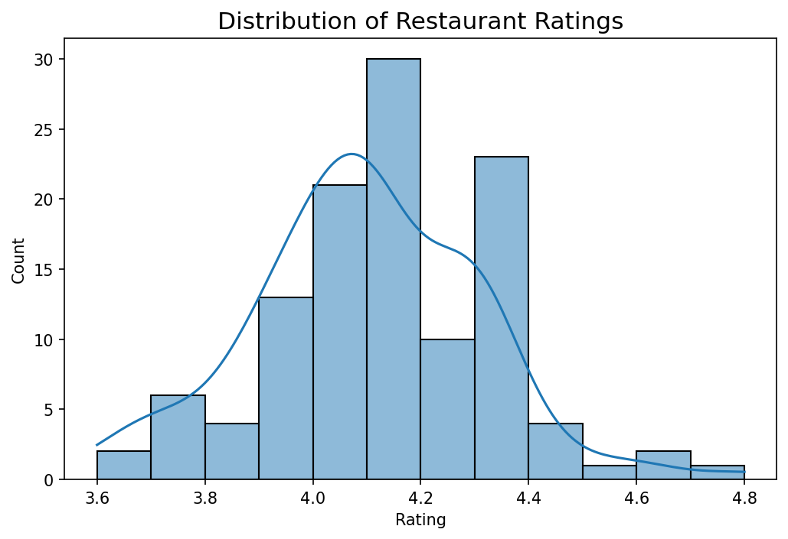
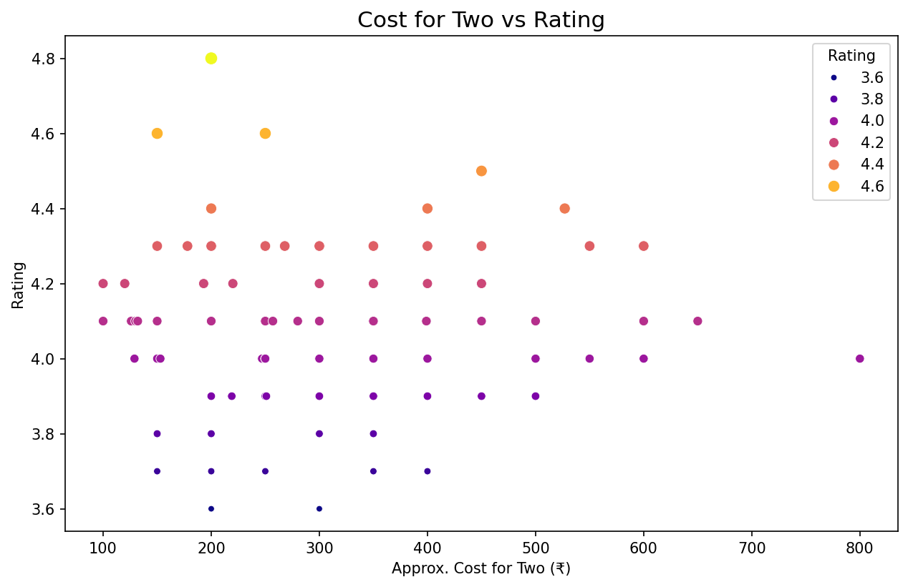
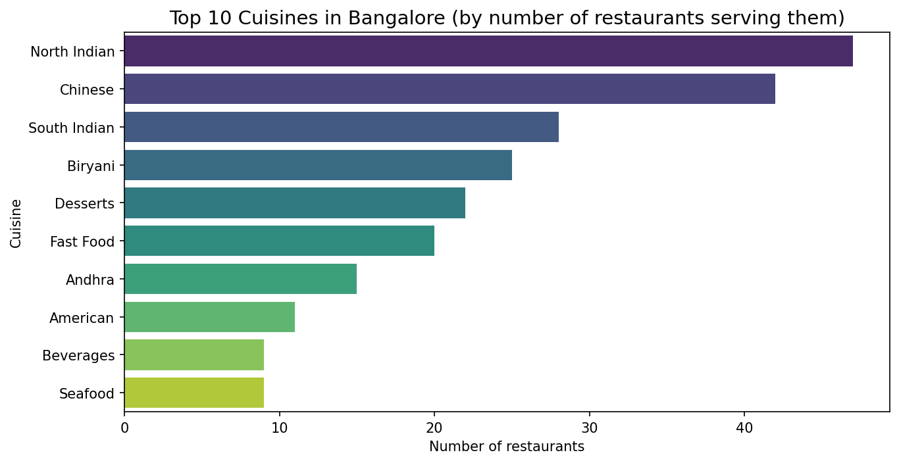

# 🍔 Swiggy Bangalore — Restaurant Data Analysis

**Exploratory data analysis of Swiggy restaurant listings across Bangalore — pricing, ratings, and cuisine insights — with full project documentation (HLD, LLD, Architecture & Wireframe).**

## 📌 Objective

Analyze Swiggy's Bangalore outlet data to understand the city's food delivery landscape: which areas have the best-rated restaurants, how pricing varies by location and cuisine, and what patterns emerge across the platform.

## 🔍 Key Insights

- **Ratings are strong platform-wide** — restaurants cluster between 4.0 and 4.3 (median 4.1, max 4.8)
- **HSR is Bangalore's most expensive area** for delivery — median cost for two of ₹350 (up to ₹800), vs ₹300 in BTM and ₹254 in Koramangala
- **Price ≠ quality**: correlation between cost and rating is near zero (0.04). The top-rated restaurants (4.5+) average just ₹262 for two, while ₹600–800 outlets sit at a mediocre ~4.1 — customers reward affordable quality
- **North Indian (14.2%), Chinese (12.7%) and South Indian (8.5%)** dominate listings, with the leading cuisine flipping by area (Chinese leads BTM & Koramangala; North Indian leads HSR)
- **Data cleaning mattered**: ratings arrived as text with `'--'` for missing values, and costs carried a `₹` prefix — both required careful conversion before any analysis was valid

## 📊 Visualizations





## 🛠️ Tech Stack

`Python` · `Pandas` · `Matplotlib` · `Seaborn` · `Jupyter Notebook`

## 📁 Project Structure

```
├── data/
│   └── swiggy_bangalore_outlets.csv
├── notebooks/
│   └── swiggy_bangalore_analysis.ipynb
├── docs/                            # Full project documentation
│   ├── HLD.pdf                      # High-Level Design
│   ├── LLD.pdf                      # Low-Level Design
│   ├── Architecture.pdf
│   ├── Wireframe.pdf
│   └── DPR.pdf                      # Detailed Project Report
└── README.md
```

## ⚙️ Workflow

1. **Data Cleaning** — handled missing values, standardized price and rating columns
2. **EDA** — distribution of ratings, cost analysis, cuisine and location frequency
3. **Visualization** — charts highlighting the strongest patterns
4. **Documentation** — HLD, LLD, architecture and wireframe docs following an industry-style project lifecycle

## 🚀 How to Run

```bash
git clone https://github.com/pradeep3114/Swiggy-Data-Analysis.git
cd Swiggy-Data-Analysis
pip install pandas matplotlib seaborn jupyter
jupyter notebook notebooks/swiggy_bangalore_analysis.ipynb
```
